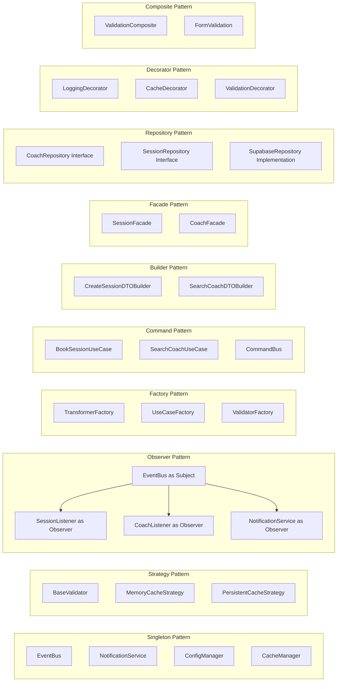
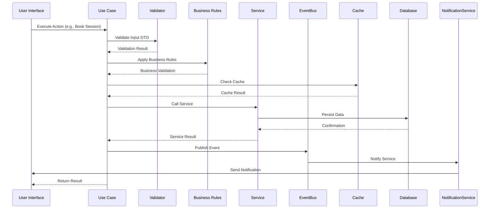
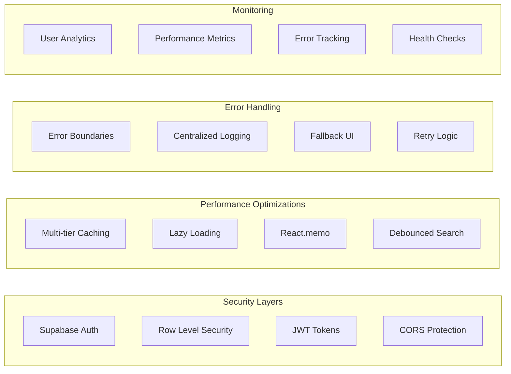

# Architecture Diagram - Caso #1 Coaching Platform

## Updated Architecture (Post FASE 1 & 2 Implementation)

```mermaid
graph TB
    %% Frontend Layer
    subgraph "Frontend Layer (React + TypeScript)"
        UI[React Components]
        UI --> AuthC[Auth Components]
        UI --> CoachC[Coach Components] 
        UI --> SessionC[Session Components]
        UI --> DashC[Dashboard Components]
        
        AuthC --> SimpleLogin[SimpleLogin]
        AuthC --> LoginForm[LoginForm]
        AuthC --> AuthProvider[AuthProvider]
        
        CoachC --> CoachCard[CoachCard]
        CoachC --> CoachList[CoachList]
        CoachC --> CoachProfile[CoachProfile]
        CoachC --> CoachSearch[CoachSearch]
        
        SessionC --> HireCoachButton[HireCoachButton]
        
        UI --> UIComps[UI Components]
        UIComps --> Button[Button]
        UIComps --> Card[Card]
        UIComps --> Input[Input]
        UIComps --> Modal[Modal]
        UIComps --> ThemeToggle[ThemeToggle]
    end

    %% Business Logic Layer (FASE 1)
    subgraph "Business Logic Layer"
        BL[Business Rules]
        BL --> SessionRules[SessionRules]
        BL --> CoachRules[CoachRules]
        
        UC[Use Cases]
        UC --> BookSessionUC[BookSessionUseCase]
        UC --> SearchCoachUC[SearchCoachUseCase]
        
        DTO[Data Transfer Objects]
        DTO --> CreateSessionDTO[CreateSessionDTO]
        DTO --> SearchCoachDTO[SearchCoachDTO]
        
        VAL[Validators]
        VAL --> BaseValidator[BaseValidator]
        VAL --> CreateSessionValidator[CreateSessionValidator]
        VAL --> SearchCoachValidator[SearchCoachValidator]
        
        TRANS[Transformers]
        TRANS --> CoachTransformer[CoachTransformer]
        TRANS --> SessionTransformer[SessionTransformer]
    end

    %% Background Jobs & Event System (FASE 2)
    subgraph "Background Jobs & Event System"
        EB[EventBus - Singleton]
        NS[NotificationService - Singleton]
        
        LISTEN[Listeners]
        LISTEN --> SessionListener[SessionListener]
        LISTEN --> CoachListener[CoachListener]
        
        EB --> LISTEN
        EB --> NS
    end

    %% Utilities Layer (FASE 2)
    subgraph "Utilities Layer"
        UTILS[Utility Managers]
        UTILS --> ConfigManager[ConfigManager - Singleton]
        UTILS --> CacheManager[CacheManager - Strategy]
        
        FORMATTERS[Formatters]
        FORMATTERS --> DateFormatter[DateFormatter]
        FORMATTERS --> StringFormatter[StringFormatter]
        FORMATTERS --> NumberFormatter[NumberFormatter]
        
        VALIDATORS[Validation Utils]
        VALIDATORS --> ValidationUtils[ValidationUtils]
        VALIDATORS --> ArrayUtils[ArrayUtils]
        VALIDATORS --> ObjectUtils[ObjectUtils]
        VALIDATORS --> BrowserUtils[BrowserUtils]
    end

    %% Services Layer
    subgraph "Services Layer"
        SERVICES[Services]
        SERVICES --> PaymentService[PaymentService]
        SERVICES --> SessionService[SessionService]
        
        API[API Layer]
        API --> CoachAPI[CoachAPI]
        API --> SupabaseAPI[Supabase API]
    end

    %% Data Layer
    subgraph "Data Layer"
        MODELS[Domain Models]
        MODELS --> Coach[Coach]
        MODELS --> User[User]
        MODELS --> Session[Session]
        
        DB[(Supabase Database)]
        STORAGE[(Supabase Storage)]
    end

    %% Infrastructure Layer
    subgraph "Infrastructure Layer"
        MIDDLEWARE[Middleware]
        MIDDLEWARE --> AuthInterceptor[AuthInterceptor]
        MIDDLEWARE --> ErrorHandlerMiddleware[ErrorHandlerMiddleware]
        MIDDLEWARE --> RequestLogger[RequestLogger]
        
        ERROR[Error Handling]
        ERROR --> CustomError[CustomError]
        ERROR --> ErrorHandler[ErrorHandler]
        
        LOGGING[Logging System]
        LOGGING --> Logger[Logger]
        
        HOOKS[React Hooks]
        HOOKS --> useAuth[useAuth]
        HOOKS --> useCoachSearch[useCoachSearch]
        HOOKS --> useSessionController[useSessionController]
        HOOKS --> useTheme[useTheme]
        HOOKS --> useUserCredits[useUserCredits]
    end

    %% External Services
    subgraph "External Services"
        SUPABASE[Supabase Backend]
        NOTIFICATIONS[Push Notifications]
        ANALYTICS[Analytics Service]
    end

    %% Connections
    UI --> HOOKS
    UI --> BL
    BL --> SERVICES
    SERVICES --> API
    API --> DB
    API --> STORAGE
    
    %% Event System Connections
    BL --> EB
    SERVICES --> EB
    EB --> NS
    NS --> NOTIFICATIONS
    
    %% Utilities Connections
    UI --> UTILS
    BL --> UTILS
    SERVICES --> UTILS
    
    %% Infrastructure Connections
    API --> MIDDLEWARE
    SERVICES --> ERROR
    MIDDLEWARE --> LOGGING
    
    %% External Connections
    API --> SUPABASE
    NS --> NOTIFICATIONS
    LOGGING --> ANALYTICS

    %% Design Patterns Applied
    classDef singleton fill:#ff9999
    classDef strategy fill:#99ccff
    classDef observer fill:#99ff99
    classDef factory fill:#ffcc99
    classDef command fill:#cc99ff
    
    class EB,NS,ConfigManager singleton
    class BaseValidator,CacheManager strategy
    class SessionListener,CoachListener observer
    class CoachTransformer,SessionTransformer factory
    class BookSessionUC,SearchCoachUC command
```



## Design Patterns Implementation Map



## Data Flow Architecture



## Technology Stack

```mermaid
graph TB
    subgraph "Frontend Technologies"
        REACT[React 18.2.0]
        TS[TypeScript 5.2.2]
        VITE[Vite 6.3.6]
        TAILWIND[Tailwind CSS]
    end
    
    subgraph "Backend Technologies"
        SUPABASE[Supabase 2.58.0]
        POSTGRES[PostgreSQL]
        REALTIME[Realtime Subscriptions]
    end
    
    subgraph "Development Tools"
        JEST[Jest 29.7.0]
        ESLINT[ESLint]
        PRETTIER[Prettier]
        HUSKY[Husky Git Hooks]
    end
    
    subgraph "Deployment"
        VERCEL[Vercel/Netlify]
        GITHUB[GitHub Actions]
        DOCKER[Docker (Optional)]
    end
    
    REACT --> SUPABASE
    TS --> REACT
    VITE --> REACT
    TAILWIND --> REACT
    
    JEST --> TS
    ESLINT --> TS
    
    GITHUB --> VERCEL
```

## Security & Performance Features



## Folder Structure

```
src/
├── components/          # React Components
│   ├── auth/           # Authentication components
│   ├── coaches/        # Coach-related components
│   ├── sessions/       # Session management
│   └── ui/             # Reusable UI components
├── business/           # FASE 1: Business Logic
│   ├── rules/          # Business rules
│   ├── use-cases/      # Use case implementations
│   └── index.ts
├── background/         # FASE 2: Background Jobs
│   ├── EventBus.ts     # Singleton pub/sub system
│   ├── NotificationService.ts
│   └── index.ts
├── listeners/          # FASE 2: Event Listeners
│   ├── SessionListener.ts
│   ├── CoachListener.ts
│   └── index.ts
├── utils/              # FASE 2: Utilities
│   ├── ConfigManager.ts    # Singleton config
│   ├── CacheManager.ts     # Strategy cache
│   ├── dateFormatter.ts    # Date utilities
│   ├── stringFormatter.ts  # String utilities
│   ├── numberFormatter.ts  # Number utilities
│   ├── validationUtils.ts  # Validation system
│   └── index.ts
├── validators/         # FASE 1: Input Validation
├── transformers/       # FASE 1: Data Transformation
├── types/              # TypeScript type definitions
│   ├── dtos/           # Data Transfer Objects
│   └── index.ts
├── services/           # External service integrations
├── models/             # Domain models
├── hooks/              # Custom React hooks
├── middleware/         # Request/response middleware
├── error-handling/     # Error management
└── logging/            # Logging system

docs/
├── UX-Testing-Results.md
├── Background-Jobs-Examples.md
├── Design-Patterns-Documentation.md
└── API-Documentation.md

demo/
├── fase2-demo.ts
├── manual-test.ts
└── basic-tests.ts
```