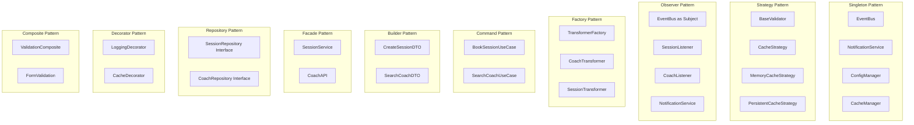
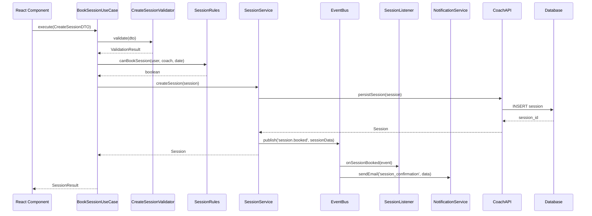

# Classes Diagram - Caso #1 Coaching Platform

## Complete Classes Diagram (Post FASE 1 & 2 Implementation)

```mermaid
classDiagram
    %% Domain Models
    class User {
        +id: string
        +email: string
        +name: string
        +credits: number
        +createdAt: Date
        +getFullName(): string
        +hasCredits(): boolean
        +deductCredits(amount: number): void
    }

    class Coach {
        +id: string
        +name: string
        +specialization: string
        +hourlyRate: number
        +rating: number
        +availability: Date[]
        +bio: string
        +isAvailable(date: Date): boolean
        +updateRating(newRating: number): void
    }

    class Session {
        +id: string
        +coachId: string
        +userId: string
        +scheduledAt: Date
        +duration: number
        +status: SessionStatus
        +price: number
        +notes: string
        +book(): void
        +cancel(): void
        +complete(): void
    }

    %% Business Layer (FASE 1)
    class SessionRules {
        <<BusinessRules>>
        +canBookSession(user: User, coach: Coach, date: Date): boolean
        +calculatePrice(coach: Coach, duration: number): number
        +validateSessionTime(date: Date): boolean
        +checkAvailability(coach: Coach, date: Date): boolean
    }

    class CoachRules {
        <<BusinessRules>>
        +canUpdateProfile(coach: Coach, updates: object): boolean
        +validateSpecialization(specialization: string): boolean
        +checkRatingBounds(rating: number): boolean
    }

    class BookSessionUseCase {
        <<UseCase>>
        -sessionRules: SessionRules
        -sessionService: SessionService
        -eventBus: EventBus
        +execute(dto: CreateSessionDTO): Promise~SessionResult~
        -validateInput(dto: CreateSessionDTO): void
        -applyBusinessRules(dto: CreateSessionDTO): void
        -persistSession(session: Session): Promise~Session~
    }

    class SearchCoachUseCase {
        <<UseCase>>
        -coachRules: CoachRules
        -coachService: CoachService
        +execute(dto: SearchCoachDTO): Promise~Coach[]~
        -buildSearchCriteria(dto: SearchCoachDTO): SearchCriteria
        -filterResults(coaches: Coach[]): Coach[]
    }

    %% DTOs (FASE 1)
    class CreateSessionDTO {
        +coachId: string
        +userId: string
        +scheduledAt: Date
        +duration: number
        +notes?: string
        +validate(): ValidationResult
    }

    class SearchCoachDTO {
        +specialization?: string
        +minRating?: number
        +maxHourlyRate?: number
        +availability?: Date
        +location?: string
        +validate(): ValidationResult
    }

    %% Validators (FASE 1) - Strategy Pattern
    class BaseValidator~T~ {
        <<interface>>
        +validate(data: T): ValidationResult
    }

    class CreateSessionValidator {
        +validate(dto: CreateSessionDTO): ValidationResult
        -validateCoachId(id: string): boolean
        -validateDateTime(date: Date): boolean
        -validateDuration(duration: number): boolean
    }

    class SearchCoachValidator {
        +validate(dto: SearchCoachDTO): ValidationResult
        -validateRating(rating: number): boolean
        -validatePrice(price: number): boolean
    }

    %% Transformers (FASE 1) - Factory Pattern
    class TransformerFactory {
        +createCoachTransformer(): CoachTransformer
        +createSessionTransformer(): SessionTransformer
        +createUserTransformer(): UserTransformer
    }

    class CoachTransformer {
        +toDTO(coach: Coach): CoachDTO
        +fromDTO(dto: CoachDTO): Coach
        +toListItem(coach: Coach): CoachListItem
    }

    class SessionTransformer {
        +toDTO(session: Session): SessionDTO
        +fromDTO(dto: SessionDTO): Session
        +toCalendarEvent(session: Session): CalendarEvent
    }

    %% Background Jobs & Event System (FASE 2) - Singleton + Observer
    class EventBus {
        <<Singleton>>
        -instance: EventBus
        -listeners: Map~string, Function[]~
        -eventHistory: EventRecord[]
        +getInstance(): EventBus
        +subscribe(eventType: string, callback: Function): void
        +unsubscribe(eventType: string, callback: Function): void
        +publish(eventType: string, data: any): void
        +getEventHistory(): EventRecord[]
        +clearHistory(): void
    }

    class NotificationService {
        <<Singleton>>
        -instance: NotificationService
        -emailTemplates: Map~string, Template~
        +getInstance(): NotificationService
        +sendEmail(template: string, data: any): Promise~void~
        +sendPushNotification(userId: string, message: string): Promise~void~
        +scheduleNotification(delay: number, notification: Notification): void
    }

    class SessionListener {
        <<Observer>>
        +onSessionBooked(event: SessionBookedEvent): void
        +onSessionCancelled(event: SessionCancelledEvent): void
        +onSessionCompleted(event: SessionCompletedEvent): void
    }

    class CoachListener {
        <<Observer>>
        +onCoachRegistered(event: CoachRegisteredEvent): void
        +onCoachProfileUpdated(event: CoachProfileUpdatedEvent): void
        +onCoachAvailabilityChanged(event: AvailabilityChangedEvent): void
    }

    %% Utilities (FASE 2) - Singleton + Strategy
    class ConfigManager {
        <<Singleton>>
        -instance: ConfigManager
        -config: Map~string, any~
        +getInstance(): ConfigManager
        +get(key: string): any
        +set(key: string, value: any): void
        +loadFromEnv(): void
        +getApiKey(service: string): string
    }

    class CacheManager {
        <<Strategy>>
        -strategy: CacheStrategy
        +setStrategy(strategy: CacheStrategy): void
        +get(key: string): any
        +set(key: string, value: any, ttl?: number): void
        +delete(key: string): void
        +clear(): void
    }

    class CacheStrategy {
        <<interface>>
        +get(key: string): any
        +set(key: string, value: any, ttl?: number): void
        +delete(key: string): void
        +clear(): void
    }

    class MemoryCacheStrategy {
        -cache: Map~string, CacheItem~
        +get(key: string): any
        +set(key: string, value: any, ttl?: number): void
        +delete(key: string): void
        +clear(): void
    }

    class PersistentCacheStrategy {
        -storage: Storage
        +get(key: string): any
        +set(key: string, value: any, ttl?: number): void
        +delete(key: string): void
        +clear(): void
    }

    class DateFormatter {
        +formatDate(date: Date, format: string): string
        +parseDate(dateString: string): Date
        +getRelativeTime(date: Date): string
        +formatDuration(minutes: number): string
        +isValidDate(date: any): boolean
    }

    class StringFormatter {
        +capitalize(str: string): string
        +slugify(str: string): string
        +truncate(str: string, length: number): string
        +formatPhone(phone: string): string
        +sanitize(str: string): string
    }

    class NumberFormatter {
        +formatCurrency(amount: number, currency: string): string
        +formatPercent(value: number): string
        +formatFileSize(bytes: number): string
        +roundToDecimal(num: number, decimals: number): number
    }

    class ValidationUtils {
        +isEmail(email: string): boolean
        +isPhone(phone: string): boolean
        +isUrl(url: string): boolean
        +isStrongPassword(password: string): boolean
        +validateCreditCard(cardNumber: string): boolean
    }

    %% Services Layer
    class PaymentService {
        -stripeClient: StripeClient
        +processPayment(amount: number, method: PaymentMethod): Promise~PaymentResult~
        +refundPayment(paymentId: string): Promise~RefundResult~
        +getPaymentHistory(userId: string): Promise~Payment[]~
    }

    class SessionService {
        -sessionRepository: SessionRepository
        -eventBus: EventBus
        +createSession(session: Session): Promise~Session~
        +cancelSession(sessionId: string): Promise~void~
        +getUpcomingSessions(userId: string): Promise~Session[]~
    }

    %% API Layer
    class CoachAPI {
        -supabaseClient: SupabaseClient
        +searchCoaches(criteria: SearchCriteria): Promise~Coach[]~
        +getCoachById(id: string): Promise~Coach~
        +updateCoachProfile(id: string, updates: object): Promise~Coach~
    }

    %% Error Handling
    class CustomError {
        +code: string
        +message: string
        +details?: any
        +timestamp: Date
        +constructor(code: string, message: string, details?: any)
    }

    class ErrorHandler {
        +handleError(error: Error): void
        +logError(error: Error): void
        +notifyError(error: Error): void
        +formatError(error: Error): ErrorResponse
    }

    %% React Hooks
    class UseAuth {
        +user: User | null
        +isLoading: boolean
        +login(email: string, password: string): Promise~void~
        +logout(): void
        +register(userData: RegisterData): Promise~void~
    }

    class UseCoachSearch {
        +coaches: Coach[]
        +isLoading: boolean
        +searchCriteria: SearchCoachDTO
        +search(criteria: SearchCoachDTO): void
        +clearResults(): void
    }

    %% Relationships
    User ||--o{ Session : books
    Coach ||--o{ Session : provides
    
    %% Business Layer Relationships
    BookSessionUseCase --> SessionRules : uses
    BookSessionUseCase --> SessionService : uses
    BookSessionUseCase --> EventBus : publishes
    SearchCoachUseCase --> CoachRules : uses
    
    %% Validation Relationships (Strategy Pattern)
    BaseValidator <|.. CreateSessionValidator : implements
    BaseValidator <|.. SearchCoachValidator : implements
    CreateSessionValidator --> CreateSessionDTO : validates
    SearchCoachValidator --> SearchCoachDTO : validates
    
    %% Transformer Relationships (Factory Pattern)
    TransformerFactory --> CoachTransformer : creates
    TransformerFactory --> SessionTransformer : creates
    CoachTransformer --> Coach : transforms
    SessionTransformer --> Session : transforms
    
    %% Event System Relationships (Observer Pattern)
    EventBus --> SessionListener : notifies
    EventBus --> CoachListener : notifies
    EventBus --> NotificationService : triggers
    
    %% Cache Strategy Relationships (Strategy Pattern)
    CacheManager --> CacheStrategy : uses
    CacheStrategy <|.. MemoryCacheStrategy : implements
    CacheStrategy <|.. PersistentCacheStrategy : implements
    
    %% Service Relationships
    SessionService --> Session : manages
    PaymentService --> Session : processes_payment
    CoachAPI --> Coach : retrieves
    
    %% Hook Relationships
    UseAuth --> User : manages
    UseCoachSearch --> Coach : searches
    UseCoachSearch --> SearchCoachDTO : uses
    
    %% Error Handling Relationships
    ErrorHandler --> CustomError : handles
    
    %% Utility Usage
    BookSessionUseCase --> DateFormatter : uses
    CoachTransformer --> StringFormatter : uses
    PaymentService --> NumberFormatter : uses
```

## Design Patterns Implementation Map



## Class Interaction Flow



## Component Hierarchy

```mermaid
graph TD
    subgraph "Frontend Components"
        App[App.tsx]
        Auth[Auth Components]
        Coach[Coach Components]
        Session[Session Components]
        UI[UI Components]
        
        App --> Auth
        App --> Coach
        App --> Session
        App --> UI
        
        Auth --> SimpleLogin[SimpleLogin]
        Auth --> LoginForm[LoginForm]
        Auth --> AuthProvider[AuthProvider]
        
        Coach --> CoachCard[CoachCard]
        Coach --> CoachList[CoachList]
        Coach --> CoachProfile[CoachProfile]
        
        Session --> HireCoachButton[HireCoachButton]
        
        UI --> Button[Button]
        UI --> Card[Card]
        UI --> Input[Input]
        UI --> Modal[Modal]
    end

    subgraph "Business Logic"
        UC[Use Cases]
        BR[Business Rules]
        DTO[DTOs]
        VAL[Validators]
        TRANS[Transformers]
        
        UC --> BR
        UC --> DTO
        UC --> VAL
        UC --> TRANS
    end

    subgraph "Background System"
        EB[EventBus]
        NS[NotificationService]
        LISTEN[Event Listeners]
        
        EB --> NS
        EB --> LISTEN
    end

    subgraph "Infrastructure"
        UTILS[Utilities]
        CACHE[Cache System]
        CONFIG[Configuration]
        ERROR[Error Handling]
        
        UTILS --> CACHE
        UTILS --> CONFIG
        UTILS --> ERROR
    end

    App --> UC
    UC --> EB
    UC --> UTILS
```

