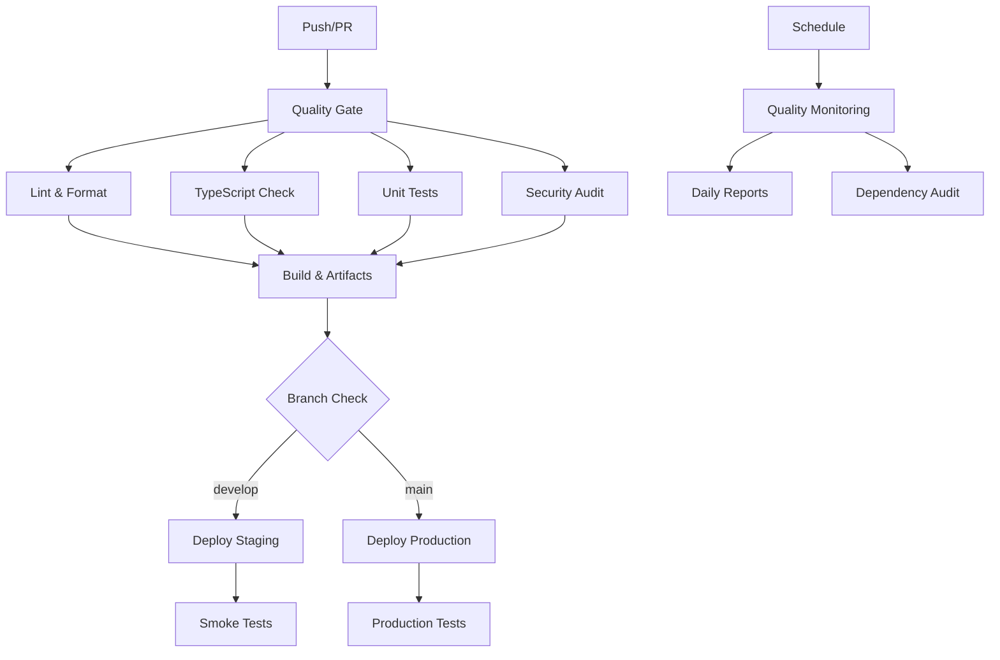

# 🚀 CI/CD Pipeline Documentation

## Descripción General

El pipeline de CI/CD para 20minCoach implementa integración y despliegue continuo con múltiples etapas de calidad, testing automatizado y deployment seguro.

## 🏗️ Arquitectura del Pipeline



## 📋 Workflows Configurados

### 1. 🔍 CI Pipeline (`ci.yml`)

**Triggers:**
- Push a `main` y `develop`
- Pull Requests a `main`
- Ejecución manual

**Jobs:**
- **lint-and-format**: Verificación de código con ESLint y Prettier
- **build-and-typecheck**: Compilación y verificación de tipos (Node 18/20)
- **test**: Tests unitarios con coverage
- **security-audit**: Auditoría de seguridad con npm audit y Snyk
- **quality-gate**: Resumen de calidad y gate de aprobación

### 2. 🚀 Deployment Pipeline (`deploy.yml`)

**Triggers:**
- Push a `main` (producción)
- Push a `develop` (staging)
- Deployment manual

**Environments:**
- **Staging**: `https://staging.20mincoach.app`
- **Production**: `https://20mincoach.app`

**Features:**
- Pre-deployment quality checks
- Environment-specific builds
- Smoke tests post-deployment
- Rollback capabilities

### 3. 📊 Quality Monitoring (`quality-monitoring.yml`)

**Schedule:** Diario a las 6:00 AM UTC

**Monitoring:**
- Daily quality audits
- Dependency vulnerability scans
- Performance metrics
- Bundle size analysis
- Automated issue creation

## 🛠️ Configuración Requerida

### GitHub Secrets

```bash
# Vercel Deployment
VERCEL_TOKEN=xxx                    # Vercel deployment token
VERCEL_ORG_ID=xxx                  # Vercel organization ID
VERCEL_PROJECT_ID=xxx              # Vercel project ID

# Environment Variables
STAGING_API_URL=xxx                # Staging API URL
STAGING_SUPABASE_URL=xxx           # Staging Supabase URL
STAGING_SUPABASE_ANON_KEY=xxx      # Staging Supabase key

PRODUCTION_API_URL=xxx             # Production API URL
PRODUCTION_SUPABASE_URL=xxx        # Production Supabase URL
PRODUCTION_SUPABASE_ANON_KEY=xxx   # Production Supabase key

# Security Scanning
SNYK_TOKEN=xxx                     # Snyk security token (optional)
```

### Repository Settings

```yaml
# .github/workflows/ permissions
Contents: Read
Actions: Write
Issues: Write
Pull Requests: Write

# Branch Protection Rules (main)
- Require pull request reviews: 1
- Require status checks: CI Pipeline
- Require branches to be up to date
- Restrict pushes to matching branches
```

## 📊 Quality Gates y Métricas

### Quality Gate Criteria

| Criterio | Threshold | Acción en Fallo |
|----------|-----------|-----------------|
| **ESLint Errors** | 0 | Bloquea deployment |
| **Build Success** | 100% | Bloquea deployment |
| **TypeScript Errors** | 0 | Bloquea deployment |
| **Security Issues** | Critical: 0 | Bloquea deployment |
| **Test Coverage** | >80% | Warning |

### Performance Thresholds

| Métrica | Target | Error Threshold |
|---------|--------|-----------------|
| **Performance Score** | >80 | <70 |
| **Accessibility Score** | >90 | <85 |
| **Best Practices** | >85 | <75 |
| **SEO Score** | >80 | <70 |
| **First Contentful Paint** | <2s | >3s |
| **Largest Contentful Paint** | <3s | >4s |
| **Cumulative Layout Shift** | <0.1 | >0.2 |

## 🔧 Comandos Locales

### Simular Pipeline Localmente

```bash
# Quality checks (como en CI)
npm run lint                       # ESLint analysis
npm run format -- --check         # Prettier check
npm run type-check                 # TypeScript validation
npm test -- --coverage --watchAll=false  # Unit tests

# Build validation
npm run build                      # Production build
npm run preview                    # Preview build

# Security audit
npm audit                          # Dependency audit
npm audit fix                      # Fix vulnerabilities
```

### Pre-commit Simulation

```bash
# Simular git hook
npm run pre-commit                 # Runs all quality checks

# Manual quality check
npm run lint:fix                   # Fix linting issues
npm run format                     # Format code
```

## 🚨 Troubleshooting

### Common Pipeline Failures

#### 1. ESLint Errors
```bash
# Error: ESLint found errors
# Solution:
npm run lint:fix                   # Auto-fix issues
npm run lint                       # Verify fixes
```

#### 2. TypeScript Errors
```bash
# Error: TypeScript compilation failed
# Solution:
npm run type-check                 # Check types locally
# Fix type errors in IDE
```

#### 3. Build Failures
```bash
# Error: Build failed
# Solution:
npm run build                      # Build locally
# Check console for specific errors
# Verify environment variables
```

#### 4. Test Failures
```bash
# Error: Tests failed
# Solution:
npm test                           # Run tests locally
npm test -- --verbose              # Detailed output
npm test -- --watch                # Watch mode for debugging
```

#### 5. Deployment Failures
```bash
# Error: Deployment failed
# Solutions:
# 1. Check Vercel token validity
# 2. Verify environment variables
# 3. Check build artifacts
# 4. Verify DNS/domain settings
```

### Performance Issues

#### Slow CI Pipeline
- Use `cache: 'npm'` in Node.js setup
- Optimize test files and reduce test time
- Use matrix builds for parallel execution
- Skip unnecessary steps with conditions

#### Large Bundle Size
```bash
# Analyze bundle
npm run build                      # Build first
npx webpack-bundle-analyzer dist/  # Analyze bundle

# Optimization strategies
# 1. Code splitting
# 2. Tree shaking
# 3. Dynamic imports
# 4. Asset optimization
```

## 📈 Monitoring y Alertas

### Automated Monitoring

#### Daily Quality Reports
- ESLint error trends
- Security vulnerability tracking
- Performance metrics
- Bundle size monitoring

#### Automated Actions
- **High Priority Issues**: Auto-create GitHub issues
- **Security Vulnerabilities**: Auto-create PRs for fixes
- **Performance Degradation**: Slack/email notifications
- **Failed Deployments**: Immediate team alerts

### Manual Monitoring

#### Quality Dashboard
```bash
# Generate local quality report
npm run lint -- --format=json > lint-report.json
npm audit --json > security-report.json
npm run build && du -sh dist/
```

#### Performance Monitoring
```bash
# Local Lighthouse audit
npx lighthouse http://localhost:4173 --output json
npx lighthouse http://localhost:4173 --output html
```

## 🔄 Maintenance

### Weekly Tasks
- [ ] Review quality reports
- [ ] Update dependencies
- [ ] Check security advisories
- [ ] Monitor performance trends

### Monthly Tasks
- [ ] Review and update pipeline configuration
- [ ] Optimize CI/CD performance
- [ ] Update quality thresholds
- [ ] Review deployment strategies

### Quarterly Tasks
- [ ] Update GitHub Actions to latest versions
- [ ] Review security scanning tools
- [ ] Optimize build and deployment processes
- [ ] Update documentation

## 📚 Resources

- [GitHub Actions Documentation](https://docs.github.com/en/actions)
- [Vercel Deployment Guide](https://vercel.com/docs)
- [ESLint CI Integration](https://eslint.org/docs/user-guide/integrations)
- [Lighthouse CI](https://github.com/GoogleChrome/lighthouse-ci)
- [Snyk Security Scanning](https://docs.snyk.io/products/snyk-code)

---

*Documentación actualizada: FASE 3 - CI/CD Implementation*