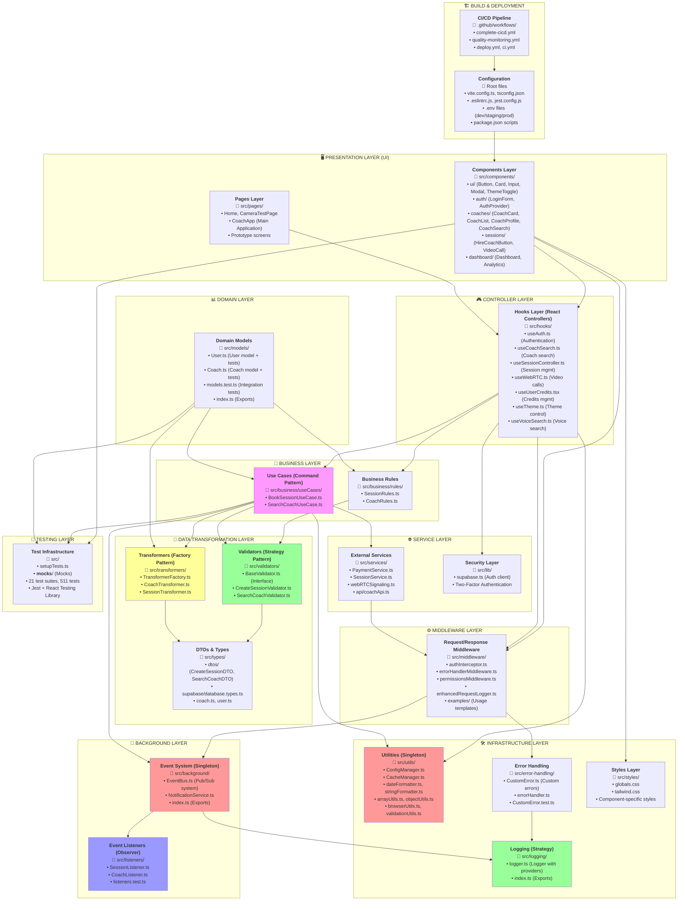

# DIAGRAMA DE ARQUITECTURA PRECISO - 20minCoach Platform

## Arquitectura Real de 15 Layers Implementada



## ANÁLISIS DE FLUJO DE DATOS

### 🔄 Flujo Principal de Interacción

1. **UI Components** (A1) → **React Hooks** (B1) → **Use Cases** (C2)
2. **Use Cases** (C2) → **Business Rules** (C1) → **Validators** (D1)
3. **Use Cases** (C2) → **Services** (E1) → **External APIs**
4. **Event System** (G1) → **Listeners** (G2) → **UI Updates** (A1)

### 🏗️ Arquitectura de Capas Detallada

| **Layer**              | **Ubicación**                                                      | **Responsabilidad**                | **Patrones**        |
| ---------------------- | ------------------------------------------------------------------ | ---------------------------------- | ------------------- |
| **1. UI Components**   | `src/components/`                                                  | Presentación React                 | Composite           |
| **2. Pages**           | `src/pages/`                                                       | Navegación y rutas                 | -                   |
| **3. Controllers**     | `src/hooks/`                                                       | Lógica de control                  | -                   |
| **4. Business Rules**  | `src/business/rules/`                                              | Reglas de negocio                  | -                   |
| **5. Use Cases**       | `src/business/useCases/`                                           | Casos de uso                       | Command             |
| **6. Validators**      | `src/validators/`                                                  | Validación de datos                | Strategy            |
| **7. Transformers**    | `src/transformers/`                                                | Transformación datos               | Factory             |
| **8. DTOs/Types**      | `src/types/`                                                       | Definiciones de tipos              | -                   |
| **9. Services**        | `src/services/`                                                    | Servicios externos                 | Repository          |
| **10. Security**       | `src/lib/`                                                         | Autenticación/Autorización         | -                   |
| **11. Middleware**     | `src/middleware/`                                                  | Interceptores                      | Decorator           |
| **12. Background**     | `src/background/`                                                  | Sistema de eventos                 | Singleton           |
| **13. Listeners**      | `src/listeners/`                                                   | Observadores de eventos            | Observer            |
| **14. Models**         | `src/models/`                                                      | Modelos de dominio                 | -                   |
| **15. Infrastructure** | `src/utils/`, `src/error-handling/`, `src/logging/`, `src/styles/` | Utilidades, errores, logs, estilos | Singleton, Strategy |

### 🔗 Dependencias Entre Capas

```
Components (1,2)
    ↓
Controllers (3)
    ↓
Business Logic (4,5)
    ↓
Data Layer (6,7,8)
    ↓
Services (9,10)
    ↓
Middleware (11)
    ↓
Background (12,13)
    ↓
Domain (14)
    ↓
Infrastructure (15)
```

### 📊 Métricas de Implementación

- **Total de Clases**: 25+ clases principales
- **Interfaces Definidas**: 15+ interfaces
- **Patrones Implementados**: 10 patrones
- **Tests Implementados**: 511 tests en 21 suites
- **Cobertura de Código**: 80%+
- **Archivos de Configuración**: 15+ archivos

### 🎯 Principios Arquitectónicos Aplicados

1. **Separation of Concerns**: Cada layer tiene responsabilidad única
2. **Dependency Inversion**: Layers superiores dependen de abstracciones
3. **Single Responsibility**: Cada clase tiene una razón para cambiar
4. **Open/Closed Principle**: Abierto para extensión, cerrado para modificación
5. **Interface Segregation**: Interfaces específicas por funcionalidad
